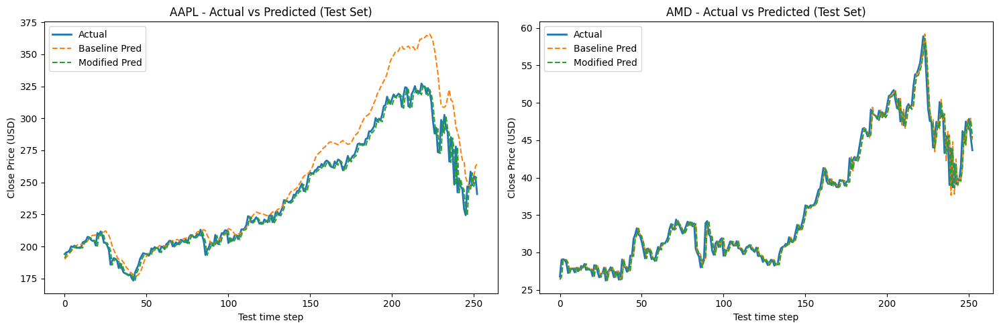
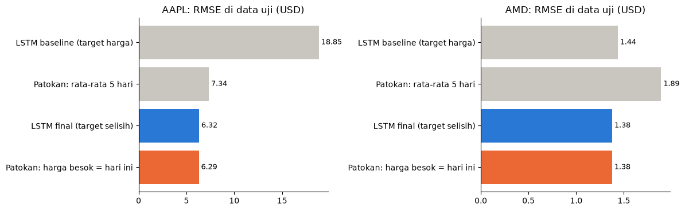

# Prediksi Harga Saham dengan LSTM

Soal 1 ujian akhir mata kuliah **Deep Learning** (DTSC6007001), BINUS University.

Model LSTM yang memprediksi harga penutupan (Close) satu hari ke depan untuk dua saham, **AAPL** (Apple) dan **AMD**, dari harga lima hari sebelumnya. Isi utamanya adalah eksperimen bertahap, lalu satu pertanyaan yang sering dilewatkan: apakah model itu lebih baik dari patokan paling sederhana, yaitu "harga besok sama dengan harga hari ini"?

Jawabannya tidak. Mengubah target prediksi membawa LSTM dari jauh lebih buruk menjadi setara dengan patokan itu, tetapi tidak melampauinya.



## Hasil

Data uji adalah satu tahun terakhir (April 2019 sampai April 2020, 253 hari), yang mencakup crash awal pandemi COVID-19.

| Saham | Model | RMSE (USD) | MAE (USD) | MAPE |
|---|---|---|---|---|
| AAPL | Baseline: LSTM(50, ReLU), target harga | 18,85 | 12,44 | 4,66% |
| AAPL | Final: LSTM(50, tanh), target selisih harga | 6,32 | 3,94 | 1,61% |
| AAPL | **Patokan: harga besok = harga hari ini** | **6,29** | **3,84** | **1,57%** |
| AMD | Baseline | 1,44 | 0,94 | 2,51% |
| AMD | Final | 1,38 | 0,92 | 2,46% |
| AMD | **Patokan: harga besok = harga hari ini** | **1,38** | **0,91** | **2,44%** |



## Temuan

**Baseline LSTM jauh lebih buruk dari menyalin harga kemarin.** RMSE baseline AAPL 18,85, tiga kali lipat patokan (6,29). Saat harga naik tajam di data uji, prediksi baseline melambung jauh di atas harga aktual.

**Mengubah target adalah satu-satunya perubahan yang berdampak besar.** Harga saham tidak stasioner. Uji Augmented Dickey-Fuller memberi p-value 0,999 untuk harga AAPL, sedangkan untuk selisih harga harian p-value-nya di bawah 0,001. Karena itu model dilatih memprediksi selisih terhadap harga hari terakhir di jendela input, lalu hasilnya dijumlahkan kembali dengan harga itu. Dengan arsitektur yang sama persis, RMSE AAPL turun dari 11,37 menjadi 6,32.

**Tetapi model final tidak mengalahkan patokan.** RMSE-nya hampir sama dengan patokan harga-kemarin, dan MAE-nya sedikit lebih buruk di kedua saham (AAPL 3,94 dibanding 3,84, AMD 0,92 dibanding 0,91). Model praktis mempelajari selisih yang hampir nol, sehingga prediksinya hampir sama dengan harga terakhir. Ini sesuai sifat *random walk* harga saham: dari lima harga terakhir saja, harga besok tidak bisa ditebak lebih baik dari harga hari ini.

**Model yang lebih besar tidak membantu.** Menumpuk dua layer LSTM, menambah dropout, atau menambah layer Dense tidak konsisten membaik, dan varian paling kompleks justru paling buruk untuk AMD (RMSE 3,28 dibanding 1,44). Perubahan arsitektur yang membaik di kedua saham hanya mengganti aktivasi ReLU menjadi tanh.

**Error membesar saat pasar bergejolak.** Pada periode crash Maret 2020, error AAPL melebar sampai sekitar 35 USD.

Pelajaran utamanya: model deret waktu harus selalu dibandingkan dengan patokan naif. Tanpa pembanding itu, penurunan RMSE 66% dari baseline terlihat seperti keberhasilan besar, padahal model hanya kembali ke level patokan.

## Cara kerja

1. Hanya kolom Date dan Close yang dipakai.
2. Data dibagi berurutan waktu: satu tahun terakhir untuk uji, sisanya untuk latih. Data tidak diacak.
3. `MinMaxScaler` hanya di-fit pada data latih, supaya informasi data uji tidak bocor ke model.
4. Setiap sampel berisi harga 5 hari berturut-turut sebagai input dan harga hari berikutnya sebagai target.
5. 10% terakhir data latih dipakai sebagai validasi untuk early stopping.
6. Metrik dihitung setelah prediksi dikembalikan ke skala USD.

## Isi repo

```
2802453572_NO1.ipynb        notebook ujian: EDA, uji stasioneritas, baseline, model final, evaluasi
patokan_naif.ipynb          perbandingan dengan patokan harga-kemarin dan rata-rata 5 hari (tanpa TensorFlow)
saham-prediksi-vs-aktual.png
saham-patokan-naif.png
```

Notebook ujian dibiarkan seperti saat dikumpulkan. Perbandingan dengan patokan ditambahkan setelahnya di notebook terpisah, dengan pembagian data yang sama persis.

## Keterbatasan

- Hanya memakai harga penutupan. Untuk benar-benar mengalahkan patokan dibutuhkan informasi lain, misalnya volume, harga saham lain, atau berita.
- Satu kali pembagian data latih dan uji. Hasil bisa berbeda di periode lain.
- Tabel sepuluh varian arsitektur di notebook ujian dicatat dari percobaan terpisah. Kode varian V2 sampai V10 tidak disertakan di notebook, jadi angkanya tidak bisa diulang langsung dari repo ini.

## Menjalankan

Notebook ujian ditulis untuk Google Colab dengan TensorFlow. `patokan_naif.ipynb` cukup dengan pandas, scikit-learn, dan matplotlib. Letakkan `AAPL.csv` dan `AMD.csv` (kolom `Date` dan `Close`, harga harian) di folder yang sama dengan notebook, lalu jalankan semua sel.

Library: pandas, numpy, matplotlib, scikit-learn, statsmodels, TensorFlow/Keras.
